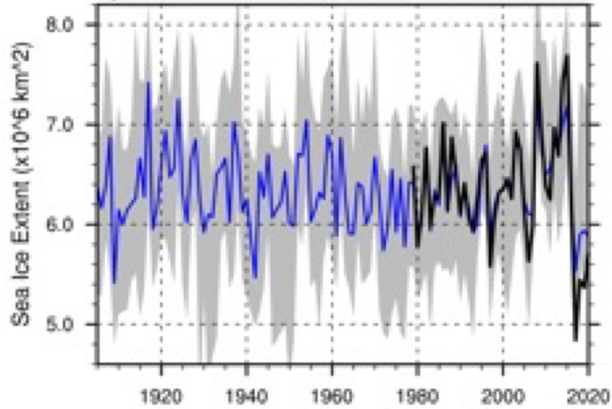

# Antarctic Sea Ice Reconstructions

This is a repository for the code and data used in Fogt et al. (2021), **A Regime Shift in Seasonal Total Antarctic Sea Ice Extent in the 20th Century**, to appear in *Nature Climate Change*.

It contains the data associated with reconstructions of Antarctic sea ice extent (monthly and seasonal) and the Antarctic sea ice concentration (seasonal).

The data is organized into folders:

 * [Seasonal observations](seasonal/observations)
 * [Seasonal Antarctic Sea Ice Extent Reconstruction (text files)](seasonal/ensembles_text)
 * [Seasonal Antarctic Sea Ice Extent Reconstruction (netcdf files)](seasonal/ensembles_netcdf)
 * [Seasonal Best Fit, Ensemble Mean Seasonal Antarctic Sea Ice Extent Reconstructions (text files)](seasonal/best_fit_text)
 * [Seasonal Best Fit, Ensemble Mean Seasonal Antarctic Sea Ice Extent Reconstructions (netcdf files)](seasonal/best_fit_netcdf)
 * [Figure Code from Fogt et al. (2021) (NCL)](seasonal/code_for_repository)

This work was supported by the National Science Foundation Office of Polar Programs.  Ryan L. Fogt and Amanda M. Sleinkofer were supported by grant OPP-1744998, and Marilyn N. Raphael and Mark S. Handcock were supported by grant OPP-1745089.

Details are available [here](https://app.dimensions.ai/details/grant/grant.7704972).

All correspondence and requests for materials should be addressed to [Ryan Fogt] (mailto:fogtr@ohio.edu).

### Reference

For further readings see:

-   Ryan L. Fogt, Amanda M. Sleinkofer, Marilyn N. Raphael, Mark S. Handcock. 2021. A Regime Shift in Seasonal Total Antarctic Sea Ice Extent in the 20th Century, to appear, [Nature Climate. Change](https://www.nature.com/nclimate/)

